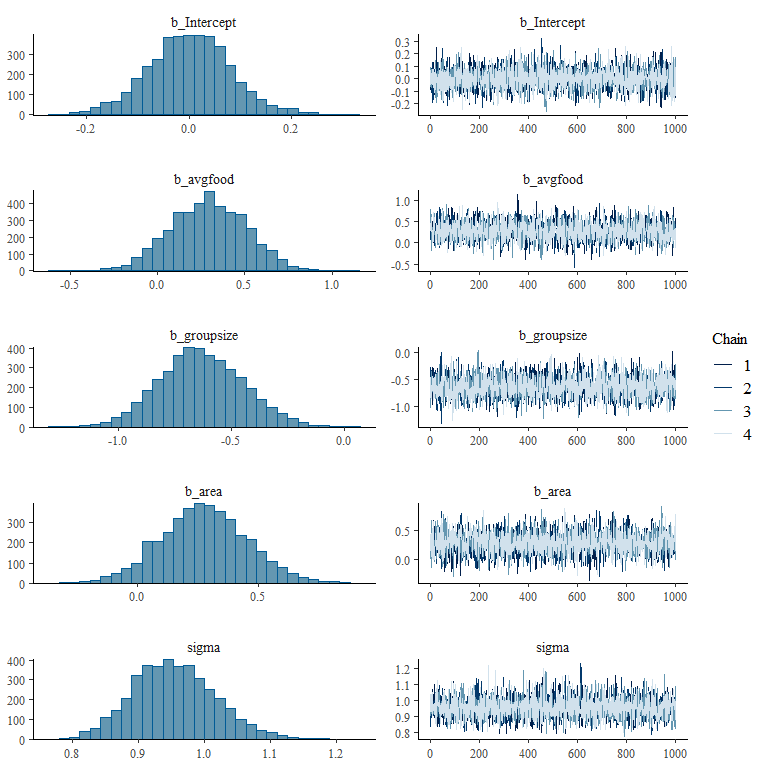
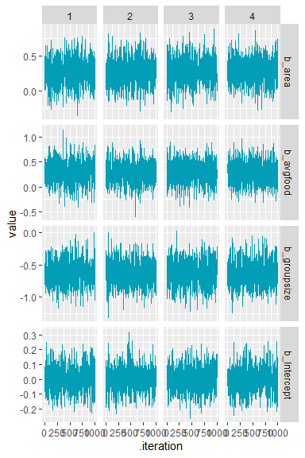

# Foxes


``` r
library(rethinking)
```

    Loading required package: cmdstanr

    This is cmdstanr version 0.8.0

    - CmdStanR documentation and vignettes: mc-stan.org/cmdstanr

    - CmdStan path: C:/Users/renatadiaz/.cmdstan/cmdstan-2.34.1

    - CmdStan version: 2.34.1

    Loading required package: posterior

    This is posterior version 1.5.0


    Attaching package: 'posterior'

    The following objects are masked from 'package:stats':

        mad, sd, var

    The following objects are masked from 'package:base':

        %in%, match

    Loading required package: parallel

    rethinking (Version 2.40)


    Attaching package: 'rethinking'

    The following object is masked from 'package:stats':

        rstudent

``` r
library(brms)
```

    Loading required package: Rcpp

    Loading 'brms' package (version 2.21.0). Useful instructions
    can be found by typing help('brms'). A more detailed introduction
    to the package is available through vignette('brms_overview').


    Attaching package: 'brms'

    The following objects are masked from 'package:rethinking':

        LOO, stancode, WAIC

    The following object is masked from 'package:stats':

        ar

``` r
library(dplyr)
```


    Attaching package: 'dplyr'

    The following objects are masked from 'package:stats':

        filter, lag

    The following objects are masked from 'package:base':

        intersect, setdiff, setequal, union

``` r
library(tidyr)
library(stringr)
library(ggplot2)
```

``` r
data(foxes)
head(foxes)
```

      group avgfood groupsize area weight
    1     1    0.37         2 1.09   5.02
    2     1    0.37         2 1.09   2.84
    3     2    0.53         2 2.05   5.33
    4     2    0.53         2 2.05   6.07
    5     3    0.49         2 2.12   5.85
    6     3    0.49         2 2.12   3.25

``` r
foxes_standardized <- foxes |>
  select(-group) |>
  mutate(across(everything(), scale))
```

``` r
m1 <- brm(weight ~ avgfood + groupsize + area,
          data = foxes_standardized,
          family = gaussian(),
          prior = c(prior(normal(0, 0.5), class = b),
                            prior(normal(0, 0.2), class = Intercept),
                            prior(exponential(1), class = sigma)))

m2 <- brm(weight ~ avgfood + groupsize,
          data = foxes_standardized,
          family = gaussian(),
          prior = c(prior(normal(0, 0.5), class = b),
                    prior(normal(0, 0.2), class = Intercept),
                    prior(exponential(1), class = sigma)))

m3 <- brm(weight ~ groupsize + area,
          data = foxes_standardized,
          family = gaussian(),
          prior = c(prior(normal(0, 0.5), class = b),
                    prior(normal(0, 0.2), class = Intercept),
                    prior(exponential(1), class = sigma)))

m4 <- brm(weight ~ avgfood,
          data = foxes_standardized,
          family = gaussian(),
          prior = c(prior(normal(0, 0.5), class = b),
                    prior(normal(0, 0.2), class = Intercept),
                    prior(exponential(1), class = sigma)))


m5 <- brm(weight ~ area,
          data = foxes_standardized,
          family = gaussian(),
          prior = c(prior(normal(0, 0.5), class = b),
                    prior(normal(0, 0.2), class = Intercept),
                    prior(exponential(1), class = sigma)))
```

``` r
load(here::here("week7-april12", "fox_models.RData"))
```

``` r
summary(m1)
```

     Family: gaussian 
      Links: mu = identity; sigma = identity 
    Formula: weight ~ avgfood + groupsize + area 
       Data: foxes_standardized (Number of observations: 116) 
      Draws: 4 chains, each with iter = 2000; warmup = 1000; thin = 1;
             total post-warmup draws = 4000

    Regression Coefficients:
              Estimate Est.Error l-95% CI u-95% CI Rhat Bulk_ESS Tail_ESS
    Intercept     0.00      0.08    -0.16     0.16 1.00     3686     2308
    avgfood       0.29      0.22    -0.12     0.70 1.00     2812     2402
    groupsize    -0.63      0.19    -0.98    -0.27 1.00     3306     2966
    area          0.28      0.18    -0.07     0.63 1.00     3165     2645

    Further Distributional Parameters:
          Estimate Est.Error l-95% CI u-95% CI Rhat Bulk_ESS Tail_ESS
    sigma     0.95      0.06     0.84     1.09 1.00     3748     2808

    Draws were sampled using sampling(NUTS). For each parameter, Bulk_ESS
    and Tail_ESS are effective sample size measures, and Rhat is the potential
    scale reduction factor on split chains (at convergence, Rhat = 1).

``` r
plot(m1)
```



See [here](https://mc-stan.org/rstan/reference/Rhat.html)

``` r
tidybayes::summarise_draws(m1)
```

    # A tibble: 8 × 10
      variable          mean   median     sd    mad       q5      q95  rhat ess_bulk
      <chr>            <dbl>    <dbl>  <dbl>  <dbl>    <dbl>    <dbl> <dbl>    <dbl>
    1 b_Intercept    0.00166  1.86e-3 0.0797 0.0778 -1.31e-1    0.132  1.00    3686.
    2 b_avgfood      0.290    2.92e-1 0.217  0.226  -6.40e-2    0.640  1.00    2812.
    3 b_groupsize   -0.632   -6.39e-1 0.186  0.184  -9.30e-1   -0.314  1.00    3306.
    4 b_area         0.277    2.74e-1 0.179  0.174  -1.07e-2    0.576  1.00    3165.
    5 sigma          0.954    9.51e-1 0.0633 0.0634  8.55e-1    1.06   1.00    3748.
    6 Intercept      0.00166  1.86e-3 0.0797 0.0778 -1.31e-1    0.132  1.00    3686.
    7 lprior        -2.37    -2.29e+0 0.708  0.690  -3.66e+0   -1.38   1.00    2986.
    8 lp__        -161.      -1.61e+2 1.59   1.44   -1.65e+2 -159.     1.00    1857.
    # ℹ 1 more variable: ess_tail <dbl>

``` r
brms::fixef(m1)
```

                  Estimate  Est.Error        Q2.5      Q97.5
    Intercept  0.001660882 0.07974084 -0.15919611  0.1639348
    avgfood    0.290002673 0.21666942 -0.12207455  0.7041740
    groupsize -0.631957891 0.18611684 -0.98307386 -0.2666215
    area       0.276845902 0.17867030 -0.07282752  0.6333044

See
[here](https://michael-franke.github.io/Bayesian-Regression/practice-sheets/11a-cheat-sheet.html#explore-via-shinystan).

``` r
as_draws_df(m1, variable = "^b_", regex = TRUE) |> 
  as_tibble() |>
  pivot_longer(starts_with("b_"), names_to = "param") |>
  mutate(param = str_replace_all(param, "b_([ab])_Intercept", "\\1")) |>
  ggplot(aes(x = .iteration, y = value)) +
  facet_grid(rows = vars(param), cols = vars(.chain), scales = "free_y") +
  geom_line(color = "#009FB7")
```


