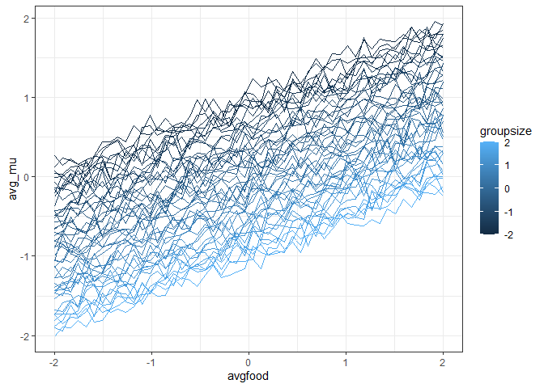

# brms foxes

``` r
library(ggplot2)
library(dplyr)
```

    Warning: package 'dplyr' was built under R version 4.3.2


    Attaching package: 'dplyr'

    The following objects are masked from 'package:stats':

        filter, lag

    The following objects are masked from 'package:base':

        intersect, setdiff, setequal, union

``` r
library(brms)
```

    Warning: package 'brms' was built under R version 4.3.3

    Loading required package: Rcpp

    Loading 'brms' package (version 2.21.0). Useful instructions
    can be found by typing help('brms'). A more detailed introduction
    to the package is available through vignette('brms_overview').


    Attaching package: 'brms'

    The following object is masked from 'package:stats':

        ar

``` r
library(rethinking)
```

    Loading required package: cmdstanr

    This is cmdstanr version 0.6.1

    - CmdStanR documentation and vignettes: mc-stan.org/cmdstanr

    - CmdStan path: C:/Users/renatadiaz/OneDrive - University of Arizona/Documents/.cmdstan/cmdstan-2.33.1

    - CmdStan version: 2.33.1


    A newer version of CmdStan is available. See ?install_cmdstan() to install it.
    To disable this check set option or environment variable CMDSTANR_NO_VER_CHECK=TRUE.

    Loading required package: posterior

    Warning: package 'posterior' was built under R version 4.3.2

    This is posterior version 1.5.0


    Attaching package: 'posterior'

    The following objects are masked from 'package:stats':

        mad, sd, var

    The following objects are masked from 'package:base':

        %in%, match

    Loading required package: parallel

    rethinking (Version 2.40)


    Attaching package: 'rethinking'

    The following objects are masked from 'package:brms':

        LOO, stancode, WAIC

    The following object is masked from 'package:stats':

        rstudent

``` r
theme_set(theme_bw())
```

``` r
data(foxes)

foxes_standardized <- foxes |>
  mutate(across(c(avgfood, weight, area, groupsize), scale))
```

# Examining pairwise relationships

``` r
ggplot(foxes_standardized, aes(area, weight)) + geom_point()
```


``` r
ggplot(foxes_standardized, aes(avgfood, weight, color = groupsize)) + 
  geom_point() +
  scale_color_viridis_c()
```


``` r
ggplot(foxes_standardized, aes(groupsize, weight)) + geom_point()
```


# Total causal effect of area on weight

## Model

$W {\sim} N({\mu}, {\sigma})$

$\{mu} {\sim} {\alpha} + {\beta}_A * A$

${\alpha} {\sim} N(0, 0.2)$

${\beta}_A {\sim} N(0, 0.5)$

${\sigma} {\sim} {\exp}(1)$

## Prior predictive sims

``` r
n = 1000

par_sims <- data.frame(
  simindex = 1:n,
  alpha_sims = rnorm(n, 0, 0.2),
  betaA_sims = rnorm(n, 0, 0.5))

areas <- seq(-2, 2, length.out = 100)

pp_sims <- expand.grid(areas, 1:n) |>
  rename(area = Var1,
         simindex = Var2) |>
  left_join(par_sims) |>
  mutate(sim_mu = alpha_sims + betaA_sims * area)
```

    Joining with `by = join_by(simindex)`

``` r
ggplot(pp_sims, aes(area, sim_mu, group = simindex)) +
  geom_line(alpha = .1) +
  geom_point(data = foxes_standardized, aes(area, weight), inherit.aes = F)
```


## Fitting the model

``` r
a_w <- brm(weight ~ area, data = foxes_standardized,
           prior = c(prior(normal(0, 0.5), class = b),
                     prior(normal(0, 0.2), class = Intercept),
                     prior(exponential(1), class = sigma)))
```

``` r
summary(a_w)
```

     Family: gaussian 
      Links: mu = identity; sigma = identity 
    Formula: weight ~ area 
       Data: foxes_standardized (Number of observations: 116) 
      Draws: 4 chains, each with iter = 2000; warmup = 1000; thin = 1;
             total post-warmup draws = 4000

    Regression Coefficients:
              Estimate Est.Error l-95% CI u-95% CI Rhat Bulk_ESS Tail_ESS
    Intercept     0.00      0.09    -0.17     0.17 1.00     4704     3463
    area          0.02      0.09    -0.16     0.20 1.00     3741     2967

    Further Distributional Parameters:
          Estimate Est.Error l-95% CI u-95% CI Rhat Bulk_ESS Tail_ESS
    sigma     1.01      0.07     0.89     1.15 1.00     3845     3107

    Draws were sampled using sampling(NUTS). For each parameter, Bulk_ESS
    and Tail_ESS are effective sample size measures, and Rhat is the potential
    scale reduction factor on split chains (at convergence, Rhat = 1).

``` r
plot(a_w)
```


# Effect of adding food

``` r
f_w <- brm(weight ~ avgfood, data = foxes_standardized,
           prior = c(prior(normal(0, 0.5), class = b),
                     prior(normal(0, 0.2), class = Intercept),
                     prior(exponential(1), class = sigma)))
```

``` r
summary(f_w)
```

     Family: gaussian 
      Links: mu = identity; sigma = identity 
    Formula: weight ~ avgfood 
       Data: foxes_standardized (Number of observations: 116) 
      Draws: 4 chains, each with iter = 2000; warmup = 1000; thin = 1;
             total post-warmup draws = 4000

    Regression Coefficients:
              Estimate Est.Error l-95% CI u-95% CI Rhat Bulk_ESS Tail_ESS
    Intercept     0.00      0.09    -0.16     0.17 1.00     3812     2983
    avgfood      -0.02      0.09    -0.20     0.16 1.00     3922     2832

    Further Distributional Parameters:
          Estimate Est.Error l-95% CI u-95% CI Rhat Bulk_ESS Tail_ESS
    sigma     1.01      0.07     0.89     1.15 1.00     4153     2920

    Draws were sampled using sampling(NUTS). For each parameter, Bulk_ESS
    and Tail_ESS are effective sample size measures, and Rhat is the potential
    scale reduction factor on split chains (at convergence, Rhat = 1).

``` r
plot(f_w)
```


# Effect of groupsize

``` r
f_g_w <- brm(weight ~ avgfood + groupsize, data = foxes_standardized,
           prior = c(prior(normal(0, 0.5), class = b),
                     prior(normal(0, 0.2), class = Intercept),
                     prior(exponential(1), class = sigma)))
```

``` r
summary(f_g_w)
```

     Family: gaussian 
      Links: mu = identity; sigma = identity 
    Formula: weight ~ avgfood + groupsize 
       Data: foxes_standardized (Number of observations: 116) 
      Draws: 4 chains, each with iter = 2000; warmup = 1000; thin = 1;
             total post-warmup draws = 4000

    Regression Coefficients:
              Estimate Est.Error l-95% CI u-95% CI Rhat Bulk_ESS Tail_ESS
    Intercept    -0.00      0.08    -0.16     0.16 1.00     3314     2636
    avgfood       0.47      0.18     0.12     0.81 1.00     2019     2257
    groupsize    -0.57      0.18    -0.90    -0.20 1.00     1978     2343

    Further Distributional Parameters:
          Estimate Est.Error l-95% CI u-95% CI Rhat Bulk_ESS Tail_ESS
    sigma     0.96      0.06     0.85     1.10 1.00     3351     2682

    Draws were sampled using sampling(NUTS). For each parameter, Bulk_ESS
    and Tail_ESS are effective sample size measures, and Rhat is the potential
    scale reduction factor on split chains (at convergence, Rhat = 1).

``` r
plot(f_g_w)
```


## Predictions conditioned on avgfood, groupsize

``` r
simfood <- seq(-2, 2, length.out = 50)
simgroup <- seq(-2, 2, length.out = 50)

simdat <- expand.grid(simfood, simgroup) |>
  rename(avgfood = Var1,
         groupsize = Var2)

f_g_w_preds <- posterior_predict(f_g_w, newdata = simdat, ndraws = 100)

f_g_w_tidy <- t(f_g_w_preds) |>
  as.data.frame() |>
  cbind(simdat) |>
  tidyr::pivot_longer(-c(avgfood, groupsize), names_to = "simdraw", values_to = "pred_mu") |>
  group_by(avgfood, groupsize) |>
  summarize(avg_mu = mean(pred_mu),
         upper_mu = quantile(pred_mu, probs = .975),
         lower_mu = quantile(pred_mu, probs = .025))
```

    `summarise()` has grouped output by 'avgfood'. You can override using the
    `.groups` argument.

``` r
ggplot(f_g_w_tidy, aes(groupsize, avg_mu, group = avgfood, color = avgfood)) +
  geom_line()
```


``` r
ggplot(f_g_w_tidy, aes(avgfood, avg_mu, group = groupsize, color = groupsize)) +
  geom_line()
```


